# AI Revenue Recovery Platform

An AI-powered revenue recovery and payment decision platform designed to help businesses identify failed payments, evaluate recovery opportunities, recommend optimal recovery strategies, and track every decision through policy-based guardrails and audit logging.

The platform combines **AI-driven recovery analysis, smart retry strategies, alternate payment recommendations, personalized recovery actions, simulation, analytics, and auditability** into a single dashboard.

---

## 🚀 Project Overview

Failed payments can result in significant revenue leakage for businesses.

This project provides an intelligent recovery platform that analyzes failed payment cases and determines the most suitable recovery action based on:

* Recovery probability
* Payment history
* Transaction value
* Failure reason
* Recovery policies
* Retry limits
* Approval requirements
* Selected recovery strategy

Every recommendation passes through configurable **policy and guardrail validation** before being considered for execution.

---

## ✨ Key Features

### 💳 Payment Management

* View failed payment transactions
* Track transaction amount and status
* Identify payment failure reasons
* Monitor recovery opportunities

### 🤖 AI Recovery Analysis

* Calculate recovery probability
* Analyze failed payment scenarios
* Recommend suitable recovery actions
* Track potential revenue recovery
* Generate decision explanations

### 🔄 Recovery Strategies

The platform supports multiple recovery strategies:

* **Smart Retry** — Retry failed payments at an optimized time
* **Personalized Messaging** — Customer-specific recovery reminders
* **Alternate Payment** — Suggest alternative payment methods
* **AI Adaptive Strategy** — Dynamically select the most suitable recovery action

### 📊 Recovery Dashboard

* Revenue at Risk
* Expected Recovery
* AI Recovery
* Additional Recovery
* Recovery Rate
* Recovery outcomes

### 🧪 Recovery Simulator

Simulate different recovery strategies before execution.

The simulator allows users to:

* Select the number of failed payments
* Select recovery strategies
* Compare strategy performance
* Measure expected recovery
* Calculate incremental revenue
* Analyze transaction-level decisions
* Validate recovery guardrails

### 🛡️ Recovery Guardrails

AI recommendations are controlled using predefined business rules.

Current guardrails include:

* Maximum retry attempts
* Minimum recovery probability
* High-value transaction approval
* Stop after successful payment
* Stop after retry limit
* Escalate low-confidence decisions

### 📜 Audit Trail

Every important recovery decision can be tracked through an audit trail.

The system records:

* AI recovery probability
* Recommended action
* Guardrail result
* Execution status
* Recovered amount
* Event timestamp
* Decision details

### 📈 Analytics

The analytics module provides visibility into:

* Recovery performance
* Revenue recovery trends
* Failed payment patterns
* Strategy performance
* Recovery outcomes

### 👥 Customer Management

* View customers
* Track customer payment activity
* Add customers
* Monitor recovery-related information

---

# 🏗️ System Architecture

```text
                    ┌──────────────────────────┐
                    │        Frontend          │
                    │      React + Vite        │
                    └────────────┬─────────────┘
                                 │
                                 │ REST API
                                 ▼
                    ┌──────────────────────────┐
                    │         Backend          │
                    │     Node.js + Express     │
                    └────────────┬─────────────┘
                                 │
              ┌──────────────────┼──────────────────┐
              │                  │                  │
              ▼                  ▼                  ▼
        ┌───────────┐      ┌────────────┐    ┌──────────────┐
        │ AI Service│      │ Recovery   │    │ Audit Logger │
        │           │      │ Engine     │    │              │
        └───────────┘      └────────────┘    └──────────────┘
                                 │
                                 ▼
                    ┌──────────────────────────┐
                    │       PostgreSQL         │
                    │         Database         │
                    └──────────────────────────┘
```

---

# 🛠️ Tech Stack

## Frontend

* React.js
* Vite
* JavaScript
* Axios
* React Router
* CSS

## Backend

* Node.js
* Express.js
* REST API
* JWT Authentication

## Database

* PostgreSQL
* SQL

## Development Tools

* Git
* GitHub
* VS Code
* npm

---

# 📂 Project Structure

```text
ai-revenue-recovery/
│
├── backend/
│   ├── src/
│   │   ├── config/
│   │   │   └── db.js
│   │   │
│   │   ├── middleware/
│   │   │   └── auth.js
│   │   │
│   │   ├── routes/
│   │   │   ├── analytics.js
│   │   │   ├── auth.js
│   │   │   ├── customers.js
│   │   │   ├── dashboard.js
│   │   │   ├── payments.js
│   │   │   ├── recovery.js
│   │   │   └── simulator.js
│   │   │
│   │   ├── services/
│   │   │   ├── aiService.js
│   │   │   ├── auditLogger.js
│   │   │   ├── recoveryEngine.js
│   │   │   └── recoveryPolicy.js
│   │   │
│   │   └── server.js
│   │
│   ├── package.json
│   └── package-lock.json
│
├── database/
│   ├── schema.sql
│   └── seed.sql
│
├── frontend/
│   ├── src/
│   │   ├── components/
│   │   │   ├── Sidebar.jsx
│   │   │   └── StatCard.jsx
│   │   │
│   │   ├── pages/
│   │   │   ├── Analysis.jsx
│   │   │   ├── Analytics.jsx
│   │   │   ├── AuditTrail.jsx
│   │   │   ├── Customers.jsx
│   │   │   ├── Dashboard.jsx
│   │   │   ├── Login.jsx
│   │   │   ├── Payments.jsx
│   │   │   ├── Placeholder.jsx
│   │   │   ├── RecoverySimulator.jsx
│   │   │   └── RevenueRecovery.jsx
│   │   │
│   │   ├── services/
│   │   │   └── api.js
│   │   │
│   │   ├── App.jsx
│   │   ├── main.jsx
│   │   └── styles.css
│   │
│   ├── index.html
│   ├── package.json
│   ├── package-lock.json
│   └── vite.config.js
│
├── screenshots/
│   ├── Dashboard.png
│   ├── recovery.png
│   ├── payments.png
│   ├── ai-analysis.png
│   ├── ai-recovery.png
│   ├── Coustemer.png
│   ├── add-coust.png
│   ├── approve-recovery.png
│   ├── analysis.png
│   ├── audit-trail.png
│   ├── recovery-simulation.png
│   ├── simulation2.png
│   └── simulation3.png
│
├── .gitignore
└── README.md
```

---

# 🧠 AI Recovery Decision Flow

```text
Failed Payment
      │
      ▼
Payment Analysis
      │
      ▼
Recovery Probability
      │
      ▼
AI Strategy Selection
      │
      ▼
Policy Validation
      │
      ▼
Guardrail Validation
      │
      ├───────────────┐
      │               │
      ▼               ▼
   Approved         Blocked
      │               │
      ▼               ▼
Recovery Action    Audit Event
      │
      ▼
Recovery Result
      │
      ▼
Audit Trail
```

---

# 🔄 Recovery Strategies

| Strategy               | Description                                           |
| ---------------------- | ----------------------------------------------------- |
| Smart Retry            | Attempts recovery at an optimized retry opportunity   |
| Personalized Messaging | Sends customer-specific recovery communication        |
| Alternate Payment      | Suggests another payment method                       |
| AI Adaptive            | Dynamically selects the most suitable recovery action |

---

# 🛡️ Guardrail System

The recovery engine does not directly execute every AI recommendation.

Instead, decisions pass through business rules.

### Current Guardrails

```text
AI Recommendation
        ↓
Recovery Policy
        ↓
Minimum Probability Check
        ↓
Retry Limit Check
        ↓
High-Value Approval Check
        ↓
Final Decision
```

Example policy configuration:

```text
Maximum Retries       : 3
Minimum Probability   : 60%
High-Value Approval   : Required
```

This provides a controlled and auditable recovery process.

---

# 💰 Revenue Recovery Model

The platform tracks three important revenue values:

### Revenue At Risk

Total monetary value associated with failed payments.

### Baseline Recovery

Expected recovery without AI-driven optimization.

### AI Recovery

Revenue expected to be recovered using selected AI recovery strategies.

### Incremental Revenue

```text
Incremental Revenue =
AI Recovery - Baseline Recovery
```

This allows businesses to measure the actual impact of recovery strategies.

---

# 🧪 Recovery Simulator

The simulator allows users to run recovery scenarios without executing real payments.

Users can select:

```text
50 Payments
100 Payments
250 Payments
500 Payments
```

and compare:

```text
Smart Retry
Personalized Messaging
Alternate Payment
AI Adaptive Strategy
```

The simulator generates:

* Recovery rate
* Expected recovery
* Incremental revenue
* Strategy performance
* Recovery outcomes
* Guardrail decisions
* Transaction-level decisions

---

# 📜 Audit Trail

The audit trail provides traceability for recovery decisions.

Each event may include:

```text
Transaction
     ↓
AI Probability
     ↓
Recommended Action
     ↓
Guardrail Result
     ↓
Execution Status
     ↓
Recovered Amount
     ↓
Timestamp
```

This makes recovery decisions easier to review and audit.

---

# 🔐 Authentication

The backend uses token-based authentication.

Protected API requests use:

```text
Authorization: Bearer <token>
```

Authentication middleware validates requests before protected resources are accessed.

---

# 🗄️ Database

The database schema is maintained in:

```text
database/schema.sql
```

Sample/demo data is provided through:

```text
database/seed.sql
```

The database stores information required for:

* Users
* Customers
* Payments
* Recovery cases
* Recovery decisions
* Audit events
* Analytics

---

# 🔌 API Modules

The backend exposes REST API modules for:

```text
/api/auth
/api/dashboard
/api/payments
/api/recovery
/api/simulator
/api/analytics
/api/customers
```

These APIs are consumed by the React frontend.

---

# ⚙️ Installation & Setup

## 1. Clone Repository

```bash
git clone https://github.com/sayaliaptekar/ai-revenue-recovery.git
```

```bash
cd ai-revenue-recovery
```

---

# 2. Backend Setup

Move into the backend directory:

```bash
cd backend
```

Install dependencies:

```bash
npm install
```

Create your environment file:

```text
.env
```

Add your required database and authentication configuration.

Example:

```env
PORT=5000
DATABASE_URL=your_database_connection
JWT_SECRET=your_secret_key
```

> Never commit `.env` to GitHub.

Start the backend:

```bash
npm start
```

or, if your project uses a development script:

```bash
npm run dev
```

Backend runs on:

```text
http://localhost:5000
```

---

# 3. Database Setup

Create a PostgreSQL database.

Then execute:

```text
database/schema.sql
```

After creating the tables, execute:

```text
database/seed.sql
```

This initializes the database structure and sample data.

---

# 4. Frontend Setup

Open another terminal.

From the project root:

```bash
cd frontend
```

Install frontend dependencies:

```bash
npm install
```

Start the frontend:

```bash
npm run dev
```

Vite will provide a local URL similar to:

```text
http://localhost:5173
```

Open that URL in your browser.

---

# ▶️ Running the Complete Project

You need two terminals.

### Terminal 1 — Backend

```bash
cd backend
npm install
npm start
```

### Terminal 2 — Frontend

```bash
cd frontend
npm install
npm run dev
```

Then open the frontend URL provided by Vite.

---

# 📸 Screenshots

## Dashboard

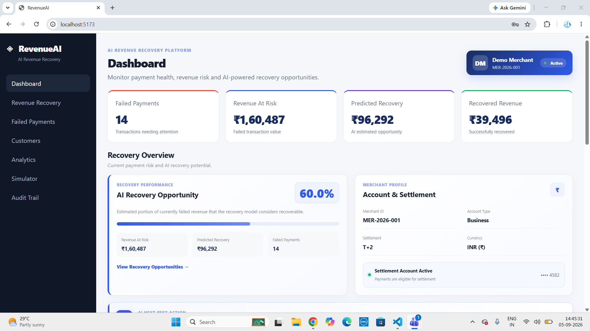

## Revenue Recovery

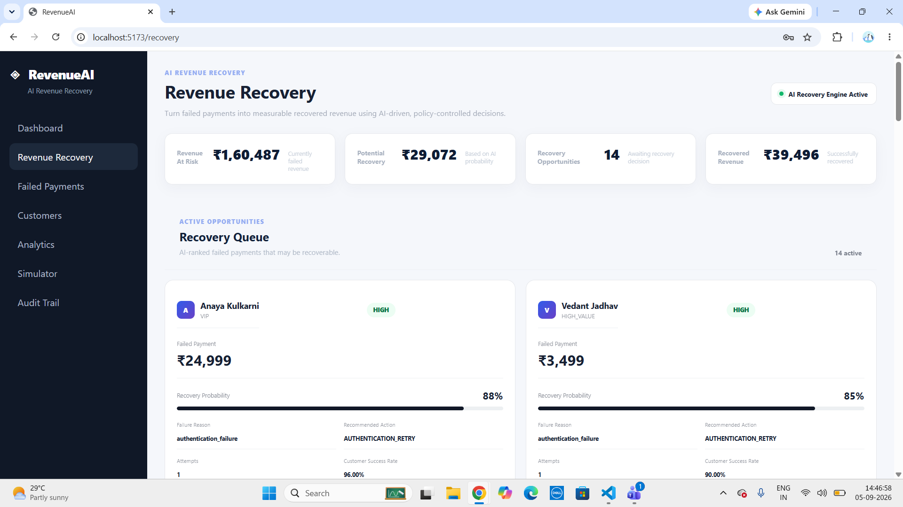

## Payments

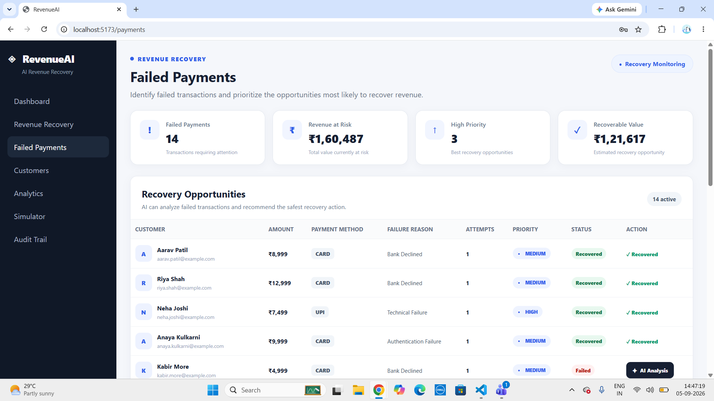

## AI Analysis

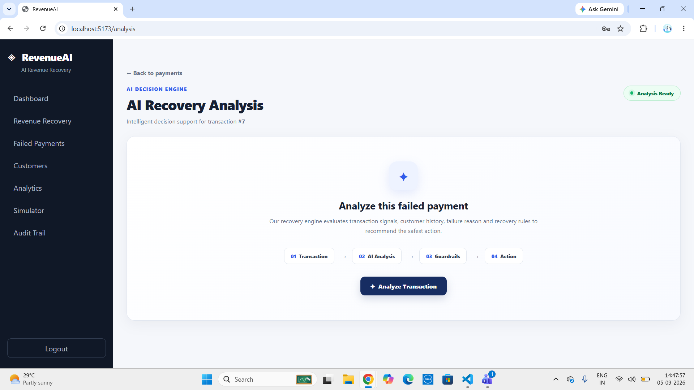

## AI Recovery

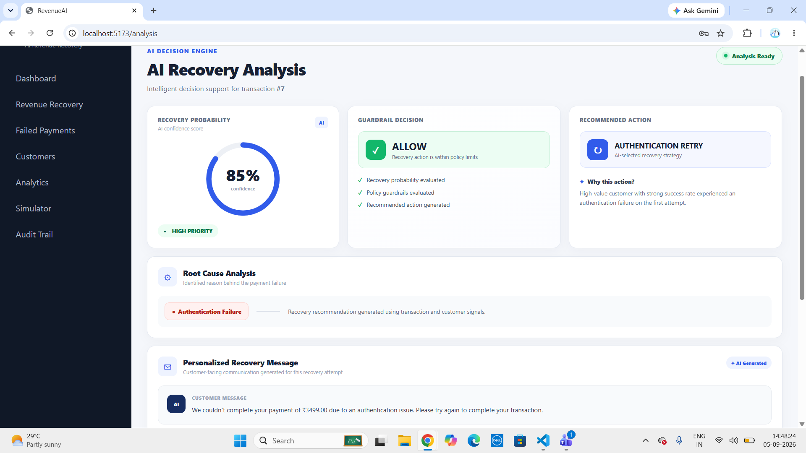

## Customer Management

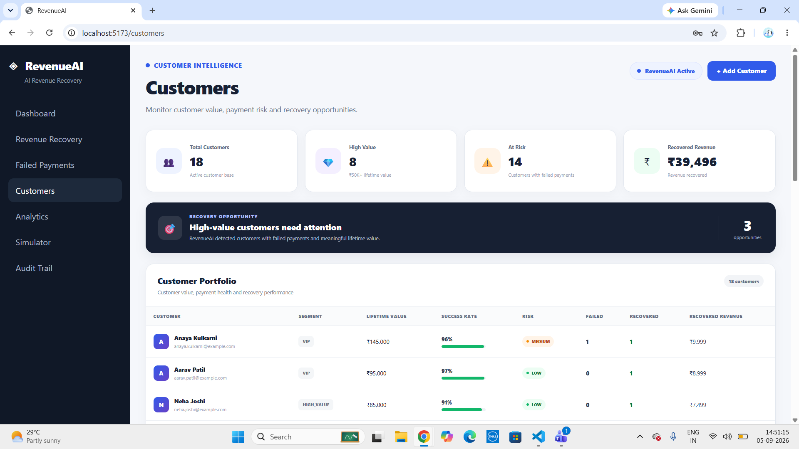

## Add Customer

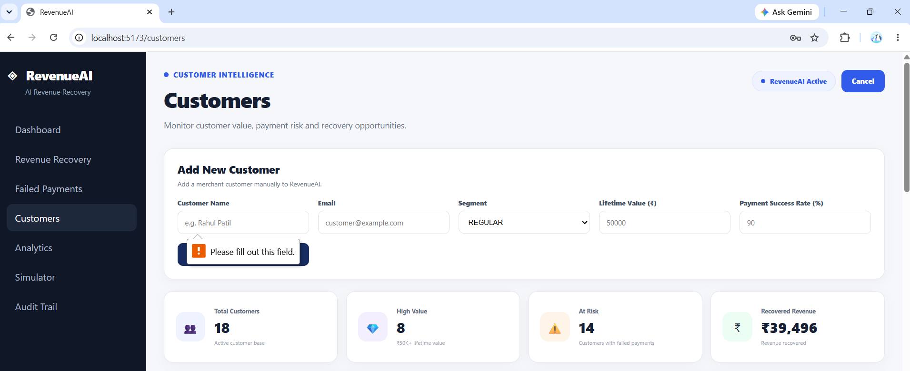

## Approve Recovery

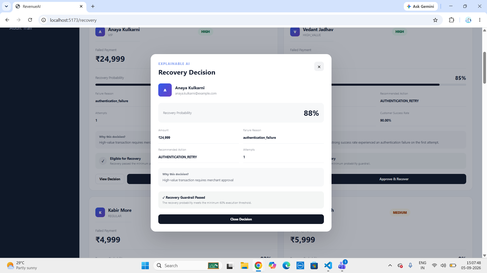

## Analysis

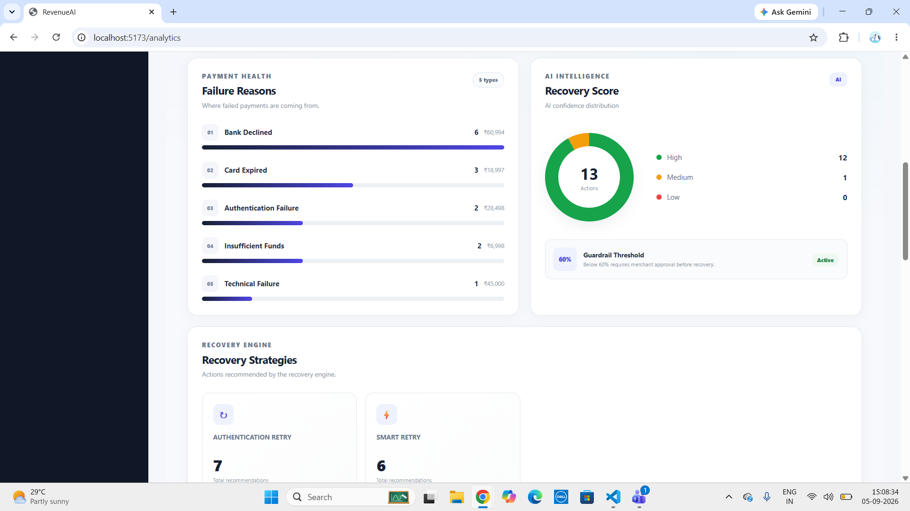

## Audit Trail

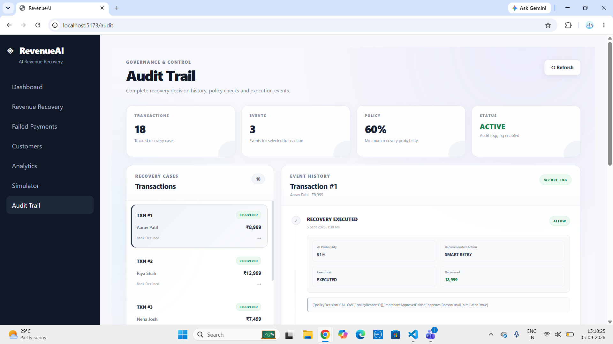

## Recovery Simulation

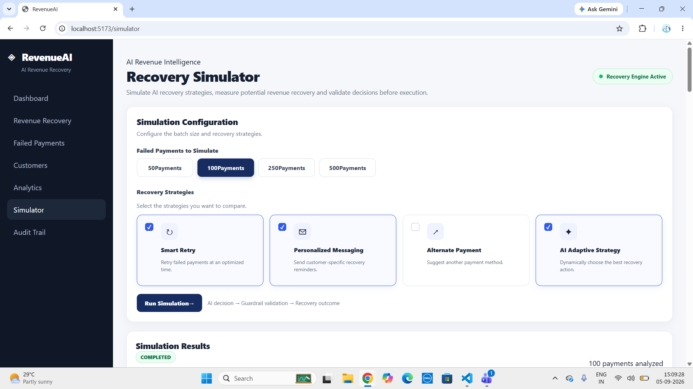

## Simulation Results

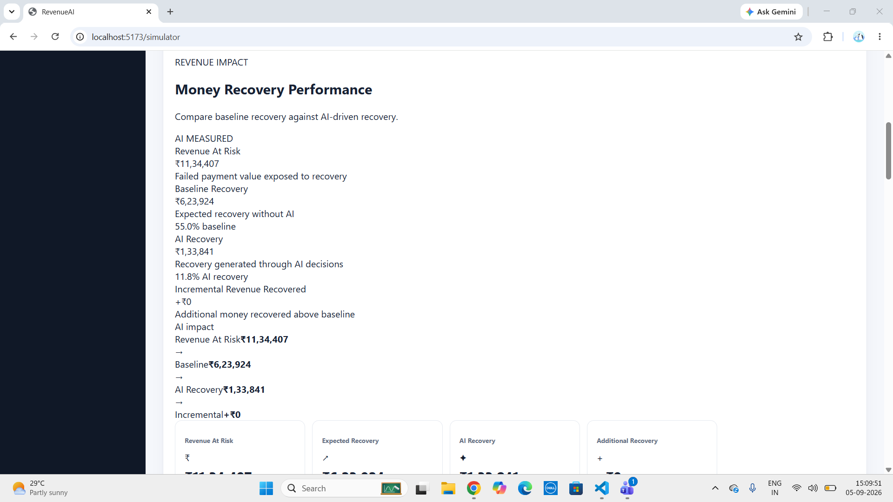

## Simulation Analysis

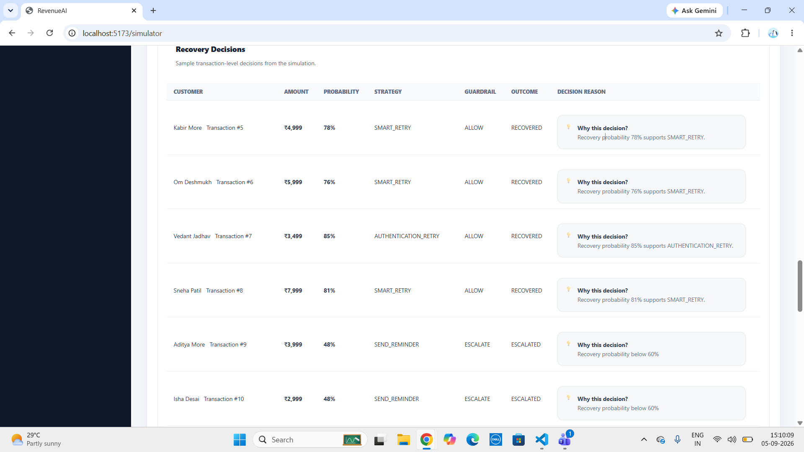

---

# 📊 Example Recovery Pipeline

```text
                 FAILED PAYMENT
                       │
                       ▼
                PAYMENT ANALYSIS
                       │
                       ▼
              RECOVERY PROBABILITY
                       │
                       ▼
                 AI DECISION
                       │
                       ▼
              RECOVERY STRATEGY
                       │
                       ▼
                POLICY CHECK
                       │
                       ▼
                GUARDRAIL CHECK
                 /           \
                /             \
           APPROVED          BLOCKED
              │                 │
              ▼                 ▼
       RECOVERY ACTION      AUDIT LOG
              │
              ▼
        RECOVERY RESULT
              │
              ▼
          AUDIT TRAIL
```

---

# 📈 Business Impact

The platform is designed to help businesses:

* Reduce revenue leakage caused by failed payments
* Identify high-probability recovery opportunities
* Optimize retry decisions
* Compare recovery strategies
* Track incremental revenue
* Reduce unnecessary retries
* Control high-value transactions
* Improve decision transparency
* Maintain an auditable recovery history

---

# 🔮 Future Enhancements

Potential future improvements include:

* Real payment gateway integration
* Real-time payment webhooks
* Advanced ML-based recovery prediction
* Customer segmentation
* Automated email/SMS integration
* Advanced revenue forecasting
* Real-time analytics
* Role-based access control
* Cloud deployment
* Distributed recovery processing
* Advanced monitoring and alerting

---

# 📌 Project Highlights

```text
✓ AI-powered recovery decisions
✓ Multiple recovery strategies
✓ Recovery simulation
✓ Revenue impact measurement
✓ Policy-based decision engine
✓ Guardrail validation
✓ Audit trail
✓ Transaction-level decision tracking
✓ Customer management
✓ Payment management
✓ Analytics dashboard
✓ REST API architecture
✓ PostgreSQL database
✓ React + Vite frontend
✓ Node.js + Express backend
```

---

# 👩‍💻 Author

**Sayali Aptekar**

Computer Science & Engineering Student

GitHub: [@sayaliaptekar](https://github.com/sayaliaptekar)

---

# 📄 License

This project is developed for educational, portfolio, and demonstration purposes.
